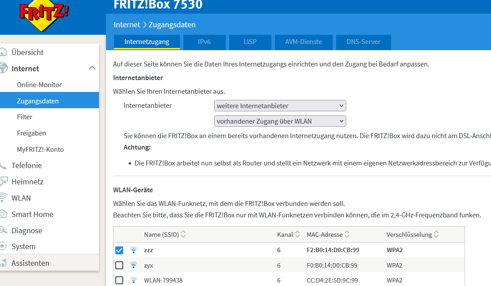

ComingHOME Videotechnik
=======================

Dies ist eine Sammlung von Konfigurations- und Script-Dateien für die Videotechnik bei ComingHOME Darmstadt.

Verzeichnisstruktur
-------------------

Die Skripte und Konfigurationen gehen davon aus, dass im Unterverzeichnis `casparcg-client` das entpackte Client-Programm (siehe `casparcg-client/README.md`) und in `casparcg-server` das Server-Programm (siehe `casparcg-server/README-videotechnik.md`) liegen.
Außerdem sollte in `dDImageViewer` ein aktueller "NDI Drag&Drop Image Viewer" (siehe http://www.zenvideo.co.uk/ndi.htm#DDImageViewer) liegen. Gestartet wird er mit `script\START_dDImageViewer.bat` oder `dDImageViewer` in den shortcuts.

Im Untervezeichnis `config` werden alle Konfigurations-Dateien gesammelt. Hierbei ist jedoch `config/media/Videos` von der Überwachung durch die Versionierung ausgenommen.

Die Programme `OBS Studio 27.2.4`, `Bitfocus Companion 2.3.0`, `NDI 5.5.2.0` und `Node.js runtime 18.12.1` werden in den vom Installationsprogramm vorgeschlagenen Ordnern erwartet. `Companion` sollte automatisch starten.

`OBS Studio` benötigt die `obs-websocket` und `obs-ndi` Plugins (siehe https://obsproject.com/forum/resources/categories/obs-studio-plugins.6/), sowie das Profil `ComingHome` und die SceneCollections `CasparCG_Audio_IN` und `ComingHome_4_Kameras` (zu finden unter `config/obs`.

`casparcg-client` kann z.Z. beim Starten nicht gleichzeitig das Rundown laden, da dann die AMCP-Befehle vom `Bitfocus Companion` nicht an den `casparcg-server` weitergegeben werden. Dies bedeutet, das zum Benutzen manuell das Rundown `config/casparcg-client.xml` geladen werden muss.

Im Verzeichnis `script\videoMonitor` müssen die npm-Module installiert sein.

Hilfe
=====

FritzBox mit WLan verbinden
---------------------------

CasparCG Server
---------------

allgemeine Dokumentation zum Server 2.3.3 LTS: [help\CasparCG-2.3.3LTS_Overview.pdf](help/CasparCG-2.3.3LTS_Overview.pdf)

Introduction to CasparCG's HTML producer: [help\HTMLproducer.html](help/HTMLproducer.html) (Download von [https://www.indr.ch/2018/09/introduction-to-casparcgs-html-producer/](https://www.indr.ch/2018/09/introduction-to-casparcgs-html-producer/))

Creating production-ready HTML templates for CasparCG: [help\production-readyHTMLtemplates.html](help/production-readyHTMLtemplates.html) (Download von [https://www.indr.ch/2019/01/creating-production-ready-html-templates-for-casparcg/](https://www.indr.ch/2019/01/creating-production-ready-html-templates-for-casparcg/))

Kanalbelegung: [help\CasparCG-Kanalbelegung.md](help/CasparCG-Kanalbelegung.md)
