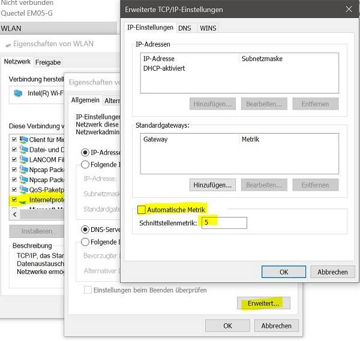
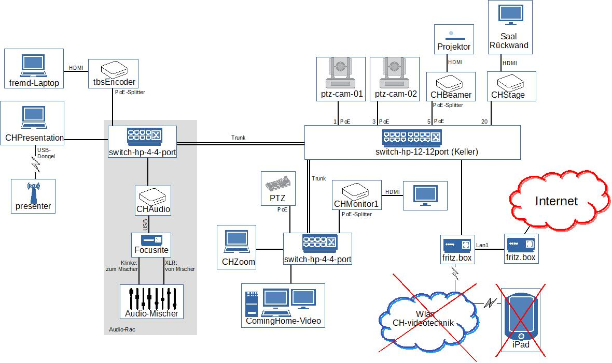

# ComingHOME Videotechnik

Dies ist eine Sammlung von Konfigurations- und Script-Dateien für die Videotechnik bei ComingHOME Darmstadt.

## Verzeichnisstruktur

Die Skripte und Konfigurationen gehen davon aus, dass im Unterverzeichnis `casparcg-client` das entpackte Client-Programm (siehe `casparcg-client/README.md`) und in `casparcg-server` das Server-Programm (siehe `casparcg-server/README-videotechnik.md`) liegen.
Außerdem sollte in `dDImageViewer` ein aktueller "NDI Drag&Drop Image Viewer" (siehe http://www.zenvideo.co.uk/ndi.htm#DDImageViewer) liegen. Gestartet wird er mit `script\START_dDImageViewer.bat` oder `dDImageViewer` in den shortcuts.

Im Untervezeichnis `config` werden alle Konfigurations-Dateien gesammelt. Hierbei ist jedoch `config/media/Videos` von der Überwachung durch die Versionierung ausgenommen.

Die Programme `Bitfocus Companion 3.0.1`, `NDI 5.5.2.0` und `Node.js runtime 18.12.1` werden in den vom Installationsprogramm vorgeschlagenen Ordnern erwartet. `Companion` sollte automatisch starten.

Der CHAudio-Rechner verwendet `OBS Studio 27.2.4` und benötigt die `obs-websocket` und `obs-ndi` Plugins (siehe https://obsproject.com/forum/resources/categories/obs-studio-plugins.6/), sowie das Profil `ComingHome` und die SceneCollection `CasparCG_Audio_IN` (zu finden unter `config/obs`.

`casparcg-client` kann z.Z. beim Starten nicht gleichzeitig das Rundown laden, da dann die AMCP-Befehle vom `Bitfocus Companion` nicht an den `casparcg-server` weitergegeben werden. Dies bedeutet, das zum Benutzen manuell das Rundown `config/casparcg-client.xml` geladen werden muss.

Im Verzeichnis `script\videoMonitor` müssen die npm-Module installiert sein.

# Hilfe

## Video in 16:9-Format bringen

`ShutterEncoder` (Icon auf dem Desktop) öffnen. Links im leeren Bereich das zu wandelnde Video platzieren. Da drunter `Start function` anklicken. Die konvertierte Datei landet am gleichen Ort wie die Originaldatei und hat ein `_h264` hinter dem Dateinamen.

## Lautstärke einer Präsentation

Ist der Ton einer Präsentation übersteuert, kann auf dem abspielenden Rechner der `Lautstärkemixer` geöffnet werden und die Ausgangslautstärke des präsentierenden Programms reduziert werden.
Das Ändern der Gesamtlautstärke (oder auch Ausschalten, weil man über den präsentierenden Rechner nichts hören will) ändert nichts daran, was das NDI-ScreenCapture an Ton bekommt.

## FritzBox mit WLan verbinden

## Route Metrik einstellen
Ausgabe der Routen mit ihren Metriken: `route print` (Option `-4` wenn sowieso nur IPv4 interessiert).
Geringe Metrik heißt höhere Prio.

### für Windows 11 Pro
Einstellungen -> `Netzwerk und Internet`
oder gleich in der Taskleiste bei Netzwerk `Netzwerk- und Inerneteinstellungen`, dann `Erweiterte Netzwerkeinstellungen` -> `Weitere Netzwerkadapteroptionen` -> bei Eigenschaften des Adapters von Interesse:

### Metrik einstellen
`Internetprotokoll, Version 4` -> Eigenschaften -> Erweitert -> `Automatische Metrik` ausschalten

## CasparCG Server

allgemeine Dokumentation zum Server 2.3.3 LTS: [help\CasparCG-2.3.3LTS_Overview.pdf](help/CasparCG-2.3.3LTS_Overview.pdf)

Introduction to CasparCG's HTML producer: [help\HTMLproducer.html](help/HTMLproducer.html) (Download von [https://www.indr.ch/2018/09/introduction-to-casparcgs-html-producer/](https://www.indr.ch/2018/09/introduction-to-casparcgs-html-producer/))

Creating production-ready HTML templates for CasparCG: [help\production-readyHTMLtemplates.html](help/production-readyHTMLtemplates.html) (Download von [https://www.indr.ch/2019/01/creating-production-ready-html-templates-for-casparcg/](https://www.indr.ch/2019/01/creating-production-ready-html-templates-for-casparcg/))

Kanalbelegung: [help\CasparCG-Kanalbelegung.md](help/CasparCG-Kanalbelegung.md)

## Übersicht Hardware-Komponenten

